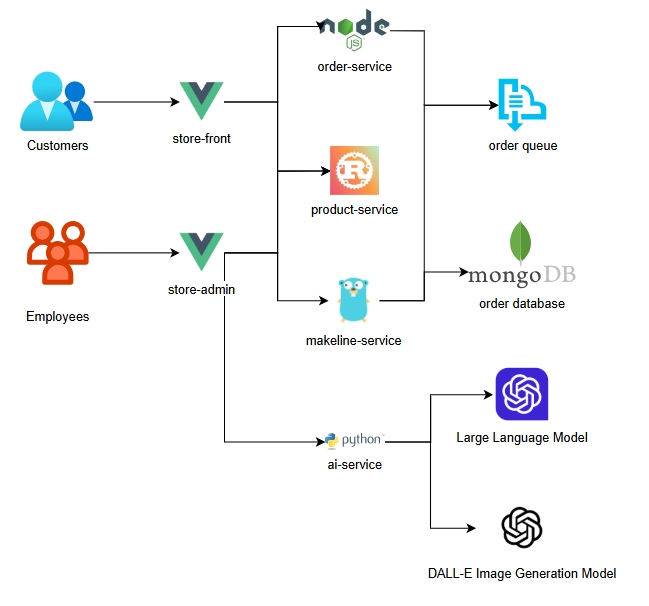

# Cloud-Native App for Best Buy

## **Application Overview**

The **Best Buy App** must include the following components:

| Service              | Description                                                  | Notes                                    |
| -------------------- | ------------------------------------------------------------ | ---------------------------------------- |
| **Store-Front**      | Customer-facing app for browsing and placing orders.         |                                          |
| **Store-Admin**      | Employee-facing app for managing products and viewing orders . |                                          |
| **Order-Service**    | Handles order creation and sends data to the managed order queue. | Replace RabbitMQ with a managed service. |
| **Product-Service**  | Handles CRUD operations for product data.                    |                                          |
| **Makeline-Service** | Processes and completes orders by reading from the order queue. |                                          |
| **AI-Service**       | Generates product descriptions and images.                   | Use GPT-4 and DALL-E models.             |
| **Database**         | MongoDB for persisting order and product data.               |                                          |

## Application Architecture

Application and Architecture Explanation

## Deployment Instructions

Step-by-step instructions to deploy the application in a Kubernetes cluster

## Microservice Repositories

| **Service**   | **Repository Link** |
| ------------- | ------------------- |
| Store-Front   | `<GitHub Link>`     |
| Order-Service | `<GitHub Link>`     |

## Docker Images

| **Service**   | **Docker Image Link** |
| ------------- | --------------------- |
| Store-Front   | `<Docker Hub Link>`   |
| Order-Service | `<Docker Hub Link>`   |

## Git Repositories

| Service            | Description                              | Github Repo                                                  |
| ------------------ | ---------------------------------------- | ------------------------------------------------------------ |
| `store-front`      | Web app for customers to place orders    | [store-front-L8](https://github.com/ramymohamed10/store-front-L8) |
| `store-admin`      | Web app for store employees              | [store-admin-L8](https://github.com/ramymohamed10/store-admin-L8) |
| `order-service`    | Handles order placement                  | [order-service-L8](https://github.com/ramymohamed10/order-service-L8) |
| `product-service`  | Handles CRUD operations on products      | [product-service-L8](https://github.com/ramymohamed10/product-service-L8) |
| `makeline-service` | Processes and completes orders           | [makeline-service-L8](https://github.com/ramymohamed10/makeline-service-L8) |
| `ai-service`       | AI-based product descriptions and images | [ai-service-L8](https://github.com/ramymohamed10/ai-service-L8) |
| `virtual-customer` | Simulates customer order creation        | [virtual-customer-L8](https://github.com/ramymohamed10/virtual-customer-L8) |
| `virtual-worker`   | Simulates order completion               | [virtual-worker-L8](https://github.com/ramymohamed10/virtual-worker-L8) |